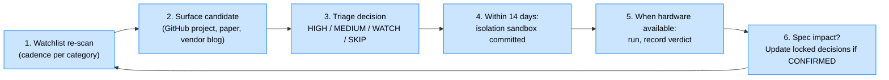

# Innovation Absorption Cadence — Operational Protocol

> **Purpose:** Operationalize the strategic insight that OCM's composition-first architecture is uniquely positioned to benefit from the velocity of the OSS AI landscape — but only if the gap between "innovation appears in the wild" and "innovation gets measured against OCM's workload" stays short. This protocol establishes a **two-week SLA** between watchlist surfacing and bench-framework sandbox committal.
> **Established:** 2026-05-09
> **Status:** Active (manual cadence). Automation candidates noted in §6.

The strategic insight this protocol operationalizes: **frontier closed teams have to predict the future of AI tooling because their stacks are monolithic; OCM gets to measure the future because the architecture is composed and the bench framework is empirical.** That's a structural edge, but it only manifests if OCM actually closes the loop from observation → measurement → integration faster than alternatives. This protocol forces the loop closed.

## The loop

The 2-week SLA applies to step 4 — the sandbox structure (`expected.json` + `docker-compose.yml` + `bench.py` skeleton + `README.md`) gets committed within 14 days of triage marking the candidate HIGH or MEDIUM. Running the sandbox can wait for hardware availability; **writing the hypothesis cannot.**

## What triggers this protocol

| Trigger | Source | Required action |
|---|---|---|
| Monthly watchlist re-scan surfaces a new entrant | `tool-watchlist.md` rescan | Triage; if HIGH/MEDIUM, sandbox within 14 days |
| Quarterly watchlist re-scan flags significant movement on existing candidate | Watchlist | Re-triage; sandbox if not yet committed |
| External event (new SOTA model, MCP spec revision, etc.) per the on-event triggers in watchlist | Variable | Immediate triage; sandbox if HIGH/MEDIUM |
| Brand or contributor stumbles on something interesting in the wild | Direct observation | Triage at next session start; sandbox per same SLA |
| Bench framework regression detection flags a previously-CONFIRMED claim is no longer holding | Retro-sync dashboard | Re-investigate; new sandbox if root cause is upstream change |

## Triage rubric

When a candidate is surfaced, classify within ~30 minutes of reading the project's README + recent commits:

| Tier | Criteria | Action |
|---|---|---|
| **HIGH** | Direct competitor or replacement for a locked OCM decision; OR claimed multiplier ≥2× on a measurable metric; OR claims to solve a known OCM gap (e.g., small-model graph extraction) | Sandbox within 7 days |
| **MEDIUM** | Adjacent capability that could compose with existing OCM stack; OR new OSS entry in a category we already measure; OR claimed measurable improvement <2× | Sandbox within 14 days |
| **WATCH** | Interesting but speculative / research-grade / pre-1.0; OR niche use case OCM doesn't currently target; OR vendor-only-claim numbers without independent verification | Add to watchlist; no sandbox yet |
| **SKIP** | Closed-source; OR license-incompatible (AGPL when OCM is Apache 2.0); OR clearly inferior to current OCM choice on every dimension we care about | Note in watchlist, no further action |

The triage is intentionally cheap — read the README, check stars + last commit, check license, decide. ~30 minutes per candidate. **A wrong triage is not catastrophic — the watchlist's recurring scans will resurface anything misclassified within the cadence window.**

## The 14-day sandbox SLA — what gets committed

Within 14 days of HIGH or MEDIUM triage, the following appears as a commit on a feature branch in `opencircuitmodel`:

1. **`bench/isolation/<category>/<tool-name>/expected.json`** — hypothesis with confirm + refute thresholds, comparison anchor, decision rule
2. **`bench/isolation/<category>/<tool-name>/docker-compose.yml`** — sandbox container spec
3. **`bench/isolation/<category>/<tool-name>/bench.py`** — measurement script skeleton
4. **`bench/isolation/<category>/<tool-name>/README.md`** — what this measures, what it doesn't, how to interpret

The sandbox does NOT need to actually run within 14 days — running gates on hardware availability and budget. **The deliverable is the written-down hypothesis, not the executed measurement.** Writing it down is the part that prevents OCM from forgetting.

`bench run --dry-run <sandbox>` must pass — this catches malformed hypotheses, broken docker-compose, or unrealistic threshold ranges before the sandbox is committed.

## Roles

For OCM in solo-founder mode, all roles collapse to Brand. As contributors join, roles split:

| Role | Solo-mode responsibility | Multi-contributor mode |
|---|---|---|
| **Scanner** | Brand (with subagent assistance per recurring-scan cadence) | Volunteer / interested contributor with category expertise |
| **Triager** | Brand | Brand or designated reviewer per category |
| **Sandbox author** | Brand (with subagent assistance) | Author of triage decision; must write `expected.json` |
| **Sandbox runner** | Brand (manual or via Modal) | Anyone with appropriate hardware class |
| **Spec impact reviewer** | Brand | Brand + at least one contributor familiar with the affected slot |

In solo mode this looks light; the value of writing it down now is that as contributors join, the role split is already documented.

## Integration with existing OCM artifacts

| Artifact | Role in this protocol |
|---|---|
| [`research/tool-watchlist.md`](../research/tool-watchlist.md) | Source of triggers (steps 1-2); record of past scans |
| [`plans/2026-05-08-ocm-bench-framework-plan.md`](../plans/2026-05-08-ocm-bench-framework-plan.md) | Defines the sandbox structure that step 4 produces |
| [`plans/2026-05-09-bench-sandbox-additions-from-research.md`](../plans/2026-05-09-bench-sandbox-additions-from-research.md) | Example output of this protocol applied to the memory deep-dive findings |
| [`specs/2026-05-08-ocm-v1-design-spec.md`](../specs/2026-05-08-ocm-v1-design-spec.md) | Updated when CONFIRMED sandboxes change locked decisions (step 6) |
| [`research/2026-05-09-memory-context-retrieval-deep-dive.md`](../research/2026-05-09-memory-context-retrieval-deep-dive.md) | Historical example of one-time deep-dive that produced 7 sandbox specs |

## Worked example — what happens if Mem0 v4 ships next month

Hypothetical: Mem0 ships v4 in June 2026 with a new "compressed-memory" mode claiming 50% token reduction at same accuracy.

| Day | Action |
|---|---|
| 0 | Mem0 v4 ships. Brand sees announcement on HN. |
| 1 | Triage: HIGH (replacement candidate for locked OCM decision; claimed multiplier on measurable metric). |
| 2-5 | Read v4 release notes + migration guide; identify the specific claim and a way to test it. |
| 5-7 | Write `bench/isolation/memory-layers/mem0-v4-compressed-mode/expected.json` with hypothesis: "Mem0 v4 compressed mode with Llama 3.1 8B Q4 maintains LongMemEval accuracy within 2pp of v3 while using ≤55% retrieval tokens." Confirm/refute thresholds. Comparison anchor: v3 numbers from prior sandbox. |
| 7-10 | Write `docker-compose.yml` + `bench.py` skeleton + `README.md`. |
| 10-12 | `bench run --dry-run` validates structure. Commit. PR or direct-to-main per repo policy. |
| 12-14 | Update `tool-watchlist.md` with `last_scanned` bump for memory-layers category; note the new sandbox in the watchlist's "recent additions" section. |
| When hardware allows | Run sandbox. CONFIRMED → spec gets updated to v4. REFUTED → stay on v3, watchlist note explains why. INCONCLUSIVE → keep both as supported alternatives. |

Total elapsed: 14 days of mostly low-effort work. The expensive part (running the actual measurement) happens on its own schedule, but the institutional memory of "we said we'd test this" is captured immediately.

## Quality gates — when sandbox writing should be REJECTED

Not every candidate deserves a sandbox even if HIGH/MEDIUM-triaged. Reject sandbox creation if:

- **The hypothesis isn't falsifiable.** "Tool X is better" isn't a hypothesis. "Tool X reduces token cost by ≥30% at equal accuracy on benchmark Y" is.
- **The comparison anchor doesn't exist or isn't reproducible.** If we can't run both the candidate and the anchor, the sandbox produces no useful verdict.
- **The threshold ranges are unjustifiable.** If "confirm at 5%, refute at 4.9%" because we want it to confirm, the sandbox is theater. Thresholds should reflect a real engineering decision.
- **The category is already saturated with similar sandboxes.** If we have 8 vector-DB sandboxes and the candidate is the 9th, the marginal value is zero. Test the differentiated thing, not yet another point in the same category.
- **The candidate is upstream-volatile.** If the project is pre-0.1, has 2 commits in the last 6 months, or shows signs of imminent abandonment, defer.

A REJECTED candidate is added to the watchlist with rejection reason. Re-triage on the next monthly scan; rejection isn't permanent.

## Failure modes — what happens when this protocol breaks

| Failure mode | What it looks like | Mitigation |
|---|---|---|
| Backlog grows faster than 14-day SLA can absorb | Watchlist accumulates HIGH-triaged candidates without sandboxes | Tighten triage rubric; demote borderline HIGH to MEDIUM; recruit a contributor specifically to write sandboxes |
| Sandboxes get written but never run | `bench run` shows 50 sandboxes, only 5 with results | Schedule monthly "run-the-backlog" days; budget cloud GPU for it; this is acceptable as long as the institutional memory is preserved |
| Triage drift — everything becomes HIGH | The rubric stops differentiating; sandbox quality drops | Mandatory monthly review of what was triaged HIGH vs what should have been; recalibrate rubric annually |
| Spec churn — locked decisions flip frequently | Spec v0.5 → v0.8 → v0.10 in three months; contributors lose track | Require evidence ≥+10pp on measured benchmark before flipping a locked decision; small wins go in "candidates to revisit" not "lock change" |
| Velocity outpaces triage | New candidate appears every day; triage takes 30 min × ∞ | Cap to 2 hours of triage per week; over-budget candidates auto-defer to next monthly scan |

## Operationalization tiers

This protocol is *manual* by default in solo-founder mode. Three escalation tiers as OCM grows:

### Tier 1 — Manual (current default)
Brand runs the loop personally with subagent assistance for scanning + sandbox-writing. Estimated effort: ~4-6 hours per month for monthly scan + 2-3 sandbox writes.

### Tier 2 — Semi-automated (3-6 months out)
- Schedule a recurring subagent dispatch via the `schedule` skill: monthly on the first of each month, run watchlist re-scan + propose triage classifications. Brand reviews + commits.
- Sandbox skeleton generation via `bench scaffold <name> --category=<cat> --hypothesis="..."` CLI tool. Reduces sandbox-writing time from ~3 hours to ~30 minutes.

### Tier 3 — Community-distributed (post-launch tier)
- Each watchlist category has a designated "champion" contributor responsible for monthly scans of their category
- Sandbox-writing via PR contribution (template provided in `bench/SANDBOX_TEMPLATE.md`)
- Triage + sandbox review as standard PR review process
- Brand reserves "spec impact reviewer" role for now; delegate as the project matures

## What "success" looks like for this protocol

If the protocol is working, these patterns hold:

- Watchlist has zero candidates older than 30 days without triage
- Bench framework has at least one sandbox per high-velocity category (M1-M4 from watchlist) added per month
- Spec changes trail measurement results, not the other way around
- New contributors can answer the question "what does OCM think about Tool X?" by checking `bench/isolation/` rather than asking
- When a frontier closed model team announces something, OCM has a sandbox measuring an open-source equivalent within ~30 days

If those patterns *aren't* holding, the protocol is broken and needs a tier escalation or rubric tightening, not abandonment.

---

**This protocol is the operational consequence of the architectural insight that OCM's mesh nature compounds the velocity of the field rather than fighting it.** Writing it down is the part that ensures OCM actually realizes that compounding rather than just claiming to.
